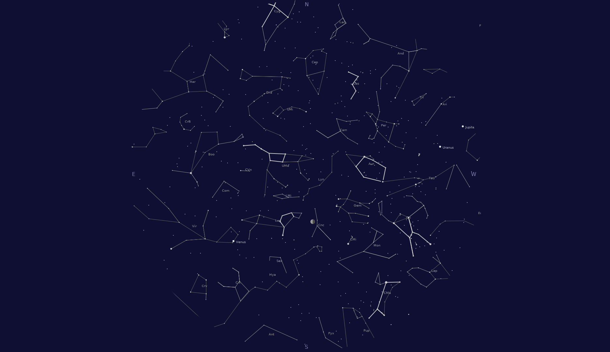

# background
a live star desktop background
(if you expect to see pictures of neil degrasse tyson i'm sorry,
this was not my intention).
see AUTHORS for &copy; included data.

Is it really worth to do something that is already available
with e.g. stellarium?

It depends what you expect.
if you want the full package with much more details and
i guess the best precision that is available,
go for a astronomy application.

On the other hand, if you want some infos on a regular basis,
this offers you some option with a app that does
not take a whole bunch of resources
(but i must admit there are more needed than i expected).
And as a side effect, some insight might be easier to gain
at a somewhat smaller scale...

Depends on genericImg see there for build instructions.